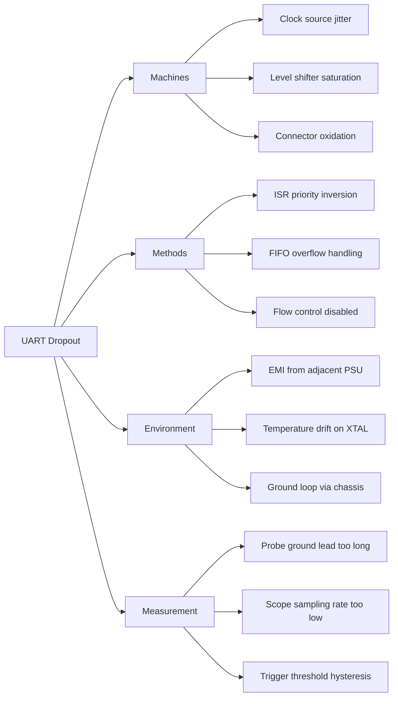

## What I Explored Today

Today I dug into the Fishbone (Ishikawa) diagram as a structured brainstorming tool for root cause analysis. After spending yesterday's session collecting raw symptom data from a UART communication dropout issue on a production line, I needed a way to move from "what happened" to "why it might have happened" without jumping to conclusions. The Fishbone diagram gave me a framework to systematically categorize potential causes across hardware, software, environment, and process domains before committing to any specific root cause hypothesis.

## The Core Concept

The Fishbone diagram, invented by Kaoru Ishikawa in the 1960s, is fundamentally a cause-and-effect visualization tool. Its power isn't in the drawing—it's in forcing the team to populate cause categories before diving into details. The "why" behind this approach is cognitive: humans naturally gravitate toward the most recent or most visible cause (recency bias). By pre-defining categories like Materials, Methods, Machines, Measurement, Environment, and People (the classic 6M framework), you force the brain to search for causes in areas it might otherwise skip.

For embedded systems, I've found the 6M categories map well:
- **Machines**: Hardware components, oscillators, regulators, connectors
- **Methods**: Software algorithms, state machines, interrupt handling, boot sequences
- **Materials**: PCB substrate, solder quality, component batch/lot numbers
- **Measurement**: Test equipment calibration, probe placement, oscilloscope triggering
- **Environment**: Temperature, humidity, EMI, vibration, power line noise
- **People**: Training gaps, procedure adherence, documentation accuracy

The diagram itself is simple: a horizontal spine (the "backbone") pointing to the effect (the "head"), with angled "ribs" for each category, and smaller "bones" branching off each rib for specific causes. The real work happens in the collaborative session where you populate those branches.

## Key Commands / Configuration / Code

I use a combination of Mermaid.js for quick digital diagrams and a physical whiteboard for team sessions. Here's the Mermaid syntax I used today for the UART dropout issue:



For a text-based approach in a terminal or log file, I use this simple ASCII format:

```
Effect: UART Dropout (every 127 bytes)
│
├── Machines
│   ├── Clock source jitter (22 MHz XTAL)
│   ├── Level shifter (TXS0108E) saturation
│   └── Connector (JST-XH) pin oxidation
│
├── Methods
│   ├── ISR priority inversion (UART vs TIM2)
│   ├── FIFO overflow (no RTS/CTS)
│   └── Flow control disabled in firmware
│
├── Environment
│   ├── EMI from 500W PSU at 60 kHz
│   ├── Temperature drift on XTAL (+15°C delta)
│   └── Ground loop via USB shield
│
└── Measurement
    ├── Probe ground lead > 6 inches
    ├── Scope sampling at 1 MS/s (aliasing)
    └── Trigger threshold at 1.5V (noise margin)
```

The key is to keep each cause specific and testable. "Bad clock" is useless; "22 MHz XTAL load capacitance mismatch (18pF vs 12pF)" is actionable.

## Common Pitfalls & Gotchas

**1. The "People" category becomes a blame dump.** In every session, someone writes "operator error" or "programmer mistake." This is toxic and unproductive. Instead, reframe "People" as "Procedures" or "Training." Ask: "What in the process allowed a mistake to happen?" not "Who made the mistake?"

**2. Too many causes per category without prioritization.** A Fishbone diagram with 50 causes is a mess. Use the 80/20 rule: identify the 2-3 most likely causes per category. If you can't, you don't understand the system well enough yet. I enforce a "three per rib" maximum during the initial session—we can add more later after data collection.

**3. Confusing correlation with causation.** Just because a cause appears on the diagram doesn't mean it's real. I've seen teams spend weeks chasing "EMI from PSU" when the real issue was a missing pull-up resistor. The Fishbone is a hypothesis generator, not a proof. Always follow up with measurement or simulation to validate each branch.

## Try It Yourself

1. **Draw a Fishbone for a recent firmware crash.** Pick a bug you encountered in the last month. Use the 6M categories (Machines, Methods, Materials, Measurement, Environment, People). For each category, write exactly three potential causes. Then, for each cause, write one sentence describing how you would test or disprove it.

2. **Convert a timeline into a Fishbone.** Take the UART dropout example above. Instead of listing causes linearly, map them onto the Fishbone structure. Notice how the diagram reveals connections you missed—for instance, the "EMI from PSU" cause might also explain the "clock jitter" observation. Cross-link those branches.

3. **Run a 15-minute Fishbone session on a current issue.** Grab a whiteboard or a Mermaid editor. Invite one colleague (preferably from a different discipline—hardware engineer if you're software, or vice versa). Set a timer for 15 minutes. The rule: no judgment, no debate, just populate branches. After the timer, spend 5 minutes voting on the top 3 causes to investigate first.

## Next Up

Tomorrow, I'll dive into **Fault Tree Analysis (FTA)** for root cause investigation. While the Fishbone gives breadth, FTA gives depth—a top-down, Boolean-logic tree that quantifies failure probabilities and reveals single-point failures. We'll apply it to the same UART dropout case and see how the two techniques complement each other.
