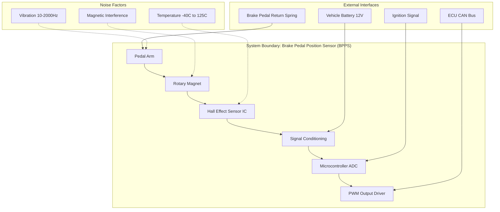

## What I Explored Today

Day 3 of the PFMEA/DFMEA Daily Log. Yesterday we laid the foundation for *why* FMEA exists and the high-level process flow. Today, I dove into the two things that make or break an FMEA before a single severity number is assigned: **who is in the room** and **what exactly we are analyzing**. I learned that a poorly scoped FMEA is worse than no FMEA—it creates false confidence. The team formation and scope definition phase is where we set the boundary conditions, and if we get this wrong, every subsequent risk assessment is built on sand.

## The Core Concept

Most engineers think FMEA starts with filling out a spreadsheet. It doesn't. It starts with a **cross-functional team** and a **clear boundary diagram**. The "why" here is simple: FMEA is a team sport, not a solo documentation exercise. A single engineer cannot foresee all failure modes—they lack the manufacturing process knowledge, the test engineering perspective, the supplier insight, and the field service experience. The scope definition prevents "scope creep" (analyzing the entire vehicle when you only need the brake pedal assembly) and "scope gaps" (forgetting the software interface).

The core principle: **The FMEA team must be small enough to be decisive, but diverse enough to cover all relevant domains.** For a typical electronic control unit (ECU) DFMEA, that means at least: systems engineer, hardware engineer, software engineer, test engineer, manufacturing engineer, and reliability engineer. For a PFMEA, add process engineers, operators (yes, operators), and quality engineers.

Scope definition uses a **Boundary Diagram** (a block diagram showing what's inside vs. outside the analysis) and a **P-Diagram** (Parameter Diagram showing inputs, outputs, control factors, noise factors, and error states). These diagrams are the "API" of your FMEA—they define the interface contract.

## Key Commands / Configuration / Code

There's no code here, but there is a structured approach. Below is a template for a **Boundary Diagram** in Mermaid (a real diagram-as-code tool used in documentation). You can paste this into any Mermaid-compatible editor (like draw.io or GitHub Markdown).

**Explanation:**
- The main block defines the system under analysis (BPPS).
- External interfaces (power, communication, mechanical) are clearly separated.
- Noise factors are listed as influences, not part of the system.
- This diagram becomes the "scope contract"—anything outside these boxes is out of scope.

For a **P-Diagram**, use a table format in your FMEA tool:

| Category | Element | Description |
|----------|---------|-------------|
| Input Signals | Pedal position (angle) | 0-90 degrees from rest |
| Input Signals | Supply voltage | 9-16V DC |
| Control Factors | Magnet material grade | N42SH |
| Control Factors | Air gap | 1.5mm ± 0.1mm |
| Noise Factors | Temperature drift | Hall sensor sensitivity shift |
| Noise Factors | Mechanical wear | Bushing degradation over 1M cycles |
| Error States | No output | PWM stuck low |
| Error States | Erratic output | PWM jitter > 5% |
| Desired Output | Linear PWM signal | 5-95% duty cycle proportional to angle |

## Common Pitfalls & Gotchas

1. **The "Expert" Trap**: I've seen teams formed with only senior engineers who "know everything." This is dangerous. Senior engineers have blind spots—they've internalized assumptions. You need a junior engineer who asks "why" and a manufacturing engineer who knows the soldering process can introduce voids. Diversity of experience, not just seniority, is critical.

2. **Scope Too Broad or Too Narrow**: A common mistake is analyzing "the entire infotainment system" when the actual concern is the touchscreen controller. The FMEA becomes a 200-row monster that nobody reads. Conversely, analyzing only the hardware without the firmware is a classic gap. *Rule of thumb*: If your FMEA has more than 50 functions, you're probably too broad. If it has fewer than 5, you're too narrow.

3. **Forgetting the "Non-Engineers"**: In PFMEA, the operator who runs the assembly line knows exactly where the process fails. They've seen the jig misalign, the glue dispenser clog, the torque wrench drift. If they're not in the room, your PFMEA is fiction. Similarly, field service engineers know what actually breaks in the field—not what the lab predicts.

## Try It Yourself

1. **Draft a Boundary Diagram**: Take a subsystem you work with (e.g., a DC-DC converter, a door lock actuator, a sensor module). Draw a boundary diagram using Mermaid or even pen and paper. List exactly what is inside the boundary, what interfaces cross it, and what noise factors exist. Share it with a colleague and ask: "Is anything missing?"

2. **Assemble a Virtual FMEA Team**: For a hypothetical product (e.g., a smart thermostat), list the minimum 5 roles you need in the room. Write a one-sentence justification for each role. Then, identify one role you initially forgot—and explain why their absence would create a blind spot.

3. **Scope a Real FMEA**: Pick a component you're currently working on. Write a one-paragraph scope statement that includes: the exact product name, the revision level, the intended operating environment, and the specific failure modes you are *excluding* (e.g., "We are not analyzing mechanical fatigue of the housing—that is covered by a separate structural analysis"). This forces clarity.

## Next Up

Tomorrow: **Function Analysis: Block Diagrams & P-Diagrams**. We'll take the boundary diagram and P-Diagram from today and turn them into the actual function list that drives the FMEA. We'll cover how to write good function statements (hint: use verb-noun pairs) and how to avoid the dreaded "function is to work correctly" trap.
