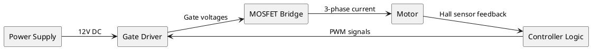

## What I Explored Today

Today I dug into the structured decomposition of system functions using block diagrams and parameter diagrams (P-Diagrams). While DFMEA brainstorming often starts with "what could break," the most robust analyses begin upstream—mapping every input, output, control factor, and noise source before a single failure mode is listed. I worked through building a functional block diagram for a brushless DC motor controller and then translated it into a P-Diagram to capture the full operating context. The result: a function-based skeleton that makes failure mode identification systematic rather than speculative.

## The Core Concept

Most engineers skip function analysis because they think they already know the system. That’s a trap. Without a formal function model, your DFMEA becomes a list of "things that went wrong last time" rather than a complete exploration of what *could* go wrong.

A **block diagram** shows the system as interconnected functional blocks. Each block has a verb-noun description of what it does (e.g., "Regulate voltage," "Filter noise"). Arrows represent energy, material, or signal flow. This forces you to define boundaries: what’s inside the system, what’s outside, and what crosses the interface.

A **P-Diagram** (Parameter Diagram) extends the block diagram by categorizing every influence on each function into four buckets:
- **Inputs** – the signal or energy the function acts upon
- **Outputs** – the ideal, intended result
- **Control Factors** – design parameters you can adjust (e.g., resistor value, gain setting)
- **Noise Factors** – everything else: environmental, degradation, piece-to-piece variation, user misuse

The P-Diagram’s genius is that it forces you to list noise factors *before* failure modes. Once you know the noises, failure modes become obvious: "What happens when this noise exceeds the control factor’s compensation range?"

## Key Commands / Configuration / Code

Here’s a practical workflow using a simple Python script to generate a P-Diagram template. I use this to standardize the format across teams.

```python
# p_diagram_generator.py
# Generates a P-Diagram CSV template for a given function block

import csv
import sys

def generate_p_diagram(function_name, inputs, outputs, controls, noises):
    """
    Creates a structured P-Diagram CSV.
    Each row is one function with its context.
    """
    filename = f"p_diagram_{function_name.replace(' ', '_')}.csv"
    with open(filename, 'w', newline='') as f:
        writer = csv.writer(f)
        writer.writerow(["Function", "Input", "Ideal Output", "Control Factors", "Noise Factors"])
        # Combine all inputs/outputs into one row per function
        writer.writerow([
            function_name,
            "; ".join(inputs),
            "; ".join(outputs),
            "; ".join(controls),
            "; ".join(noises)
        ])
    print(f"P-Diagram saved to {filename}")

# Example: BLDC motor controller "Commutation" function
if __name__ == "__main__":
    generate_p_diagram(
        function_name="Commutation",
        inputs=["Rotor position (Hall sensor)", "DC bus voltage"],
        outputs="Smooth torque, minimal audible noise".split(", "),
        controls=["Advance angle lookup table", "PWM frequency (20 kHz)", "Dead-time (500 ns)"],
        noises=[
            "Temperature drift (Hall sensors)",
            "Supply voltage ripple (100/120 Hz)",
            "Aging of MOSFET gate threshold",
            "Vibration-induced sensor misalignment"
        ]
    )
```

Run it:
```bash
python p_diagram_generator.py
# Output: p_diagram_Commutation.csv
```

For block diagrams, I use PlantUML to keep them version-controlled:



Render with:
```bash
plantuml block_diagram.puml -tpng
```

## Common Pitfalls & Gotchas

1. **Confusing inputs with control factors.** An input is what the function *must* receive to operate (e.g., rotor position). A control factor is a design parameter you *choose* (e.g., sensor type). If you list "Hall sensor type" as an input, you’ll miss the noise of sensor degradation. Keep inputs as signals/energy, controls as design knobs.

2. **Forgetting the "ideal output" column.** Many P-Diagrams only list outputs. Without specifying *ideal* output (e.g., "torque within ±2% of commanded"), you can’t later define a failure mode. A failure mode is simply "output deviates from ideal." Write the ideal explicitly.

3. **Treating noise factors as failure modes.** Noise factors are *causes*, not failures. "High ambient temperature" is a noise. "MOSFET overheats" is a failure mode. If you mix them, your DFMEA becomes a mess of root causes masquerading as failures. Keep noise factors in the P-Diagram; they feed the "cause" column later.

## Try It Yourself

1. **Pick one function from your current project** (e.g., "Regulate output voltage" in a buck converter). Draw a block diagram with at least 4 blocks. Ensure every arrow has a label (signal, energy, or material). Check: are there any arrows that cross the system boundary without a defined interface?

2. **Convert that function into a P-Diagram.** List at least 5 noise factors. For each noise factor, ask: "If this noise increases by 3 sigma, does the ideal output degrade?" If yes, you’ve found a potential failure mode. Write it down—you’ll use it tomorrow.

3. **Compare your P-Diagram with a colleague’s.** Do you have the same control factors? Different noise factors? The goal is to find gaps. If one of you listed "humidity" and the other didn’t, you just saved a field failure.

## Next Up

Tomorrow: **Failure Chain: Failure Mode, Effect & Cause Relationships**. We’ll take the P-Diagram outputs and noise factors and link them into the classic DFMEA columns—showing how a single noise factor can cascade through multiple failure modes and effects.
